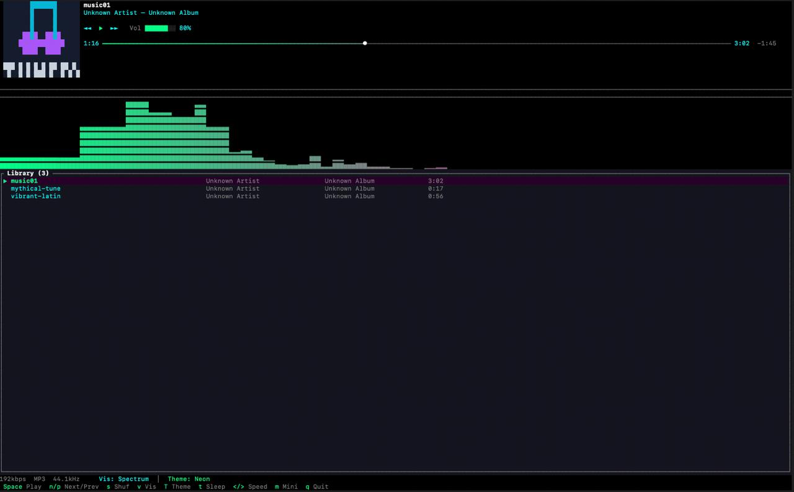
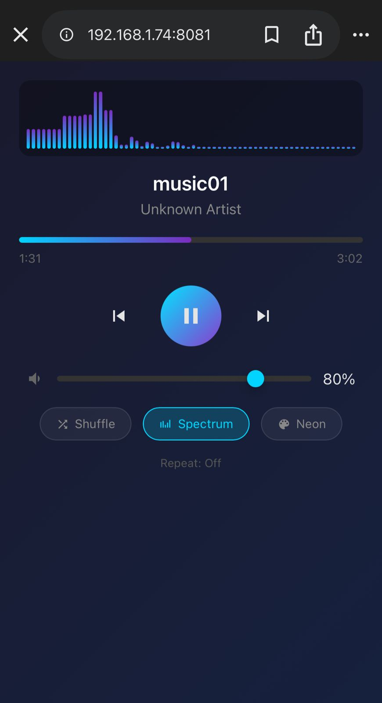

# tunebox

A terminal music player with album art, visualizer, and phone remote control.



## Install

**Requirements:** Rust toolchain ([install](https://rustup.rs/))

```bash
git clone https://github.com/himanshud2611/tunelog.git
cd tunelog
cargo install --path .
```

This installs `tunebox` to `~/.cargo/bin/`. Make sure it's in your PATH.

After install, you can delete the cloned folder - the binary is standalone (~5MB).

## Usage

```bash
tunebox ~/Music              # play a directory
tunebox song.mp3             # play a single file
tunebox ~/Music --shuffle    # start with shuffle on
tunebox ~/Music --port 8081  # remote control on custom port (default: 8080)
```

**Supported formats:** MP3, FLAC, WAV, OGG, AAC

## Remote Control

Control tunebox from your phone. When you start tunebox, it prints:

```
Remote control: http://192.168.1.74:8080
```

Open that URL on any device on the same WiFi. Features:
- Play/pause, next/prev, seek
- Volume slider
- Live visualizer
- Toggle shuffle, theme, and visualizer mode



## Keybindings

| Key | Action |
|-----|--------|
| `Space` | Play / Pause |
| `n` | Next track |
| `p` | Previous track |
| `j/k` or `↑/↓` | Navigate library |
| `Enter` | Play selected |
| `→/←` | Seek ±5 seconds |
| `+/-` or `]/[` | Volume up/down |
| `/` | Search library |
| `s` | Toggle shuffle |
| `r` | Cycle repeat (off → all → one) |
| `v` | Cycle visualizer mode |
| `i` | Toggle track info |
| `T` | Cycle theme (Default, Dracula, Nord, Gruvbox, Neon) |
| `t` | Cycle sleep timer (15/30/45/60 min) |
| `m` | Toggle mini mode |
| `</>` or `,/.` | Playback speed down/up |
| `q` | Quit |

## License

MIT
